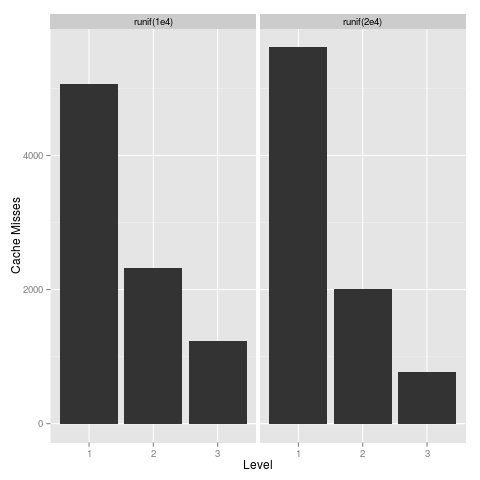

# pbdPAPI

pbdPAPI is an R package which offers a set of R bindings for the Performance
Application Programming Interface (PAPI).  PAPI is a high-level C library for 
gathering information from hardware performance counters.  PAPI measures events 
like cache misses, flops, etc.

This allows for very powerful profiling of R code (compiled code via, for 
example, Rcpp, or even just plain old vanilla R), but with a very simple
interface.

For more information about PAPI, see the official website: 
http://icl.cs.utk.edu/PAPI/


## Installation

pbdPAPI requires R version 2.14.0 or higher.  It also requires the PAPI library,
but a distribution of PAPI v 5.3.0 is bundled with the package for those who
do not already have a system installation available.  For configuration options,
and installation instructions, see the package vignette.

Unfortunately, at this time, PAPI is not supported on Windows or Mac
As such, pbdPAPI does not support these platforms either.

For a complete list of platforms which PAPI supports, see:

http://icl.cs.utk.edu/papi/custom/index.html?lid=62&slid=96


## Notes

Those with Intel Sandy Bridge and/or Intel Ivy Bridge architecutres should be 
aware that flops counts are unreliable on these platforms.  This is a problem 
with the hardware returning incorrect values, not with PAPI or pbdPAPI.  For 
more details, see: 
http://icl.cs.utk.edu/projects/papi/wiki/PAPITopics:SandyFlops

pbdPAPI only supports serial applications.  For parallel codes, see pbdPROF, and
or consider using PAPI/TAU directly in your compiled code.  For more details, 
see:  http://icl.cs.utk.edu/projects/papi/wiki/Threads


## Usage

Like its parent library PAPI, the pbdPAPI package has 2 distinct
interfaces, a low-level and a high-level.


```r
### ~4MiB
m <- 10000
n <- 50

x <- matrix(rnorm(m*n), m, n)

### Centering requires 2mn+1 operations
### SVD requires 6mn^2 + 20n^3 operations
### x %*% svd$v requires 2*m*n^2 operations
op <- expression(prcomp(x, center=TRUE, scale.=FALSE))

report <- system.flops(eval(op))
count <- report$flpops
theoretical <- 6*m*n^2 + 20*n^3 + 2*m*n^2 + 2*m*n + 1
mflops <- report$mflops

data.frame(m=m, n=n, measured=count, theoretical=theoretical, difference=count-theoretical, "pct.error"=(1.0 - (theoretical/count))*100, mflops=mflops)
#       m  n  measured theoretical difference pct.error   mflops
# 1 10000 50 218789742   203500001   15289741  6.988326 1107.302
```

The package also has some utilities for basic plotting:

```r
x <- system.cache(runif(1e4))
y <- system.cache(runif(2e4))

plot(x,y)
```




## Software license and disclaimer

This package has no official affiliation with the PAPI project.

This software is licensed under the permissive 2-clause BSD license. You can 
find a quick summary of the license here:

https://tldrlegal.com/license/bsd-2-clause-license-%28freebsd%29

The full terms of the license (it's very short) are contained in the LICENSE 
file in the root directory of the project.

